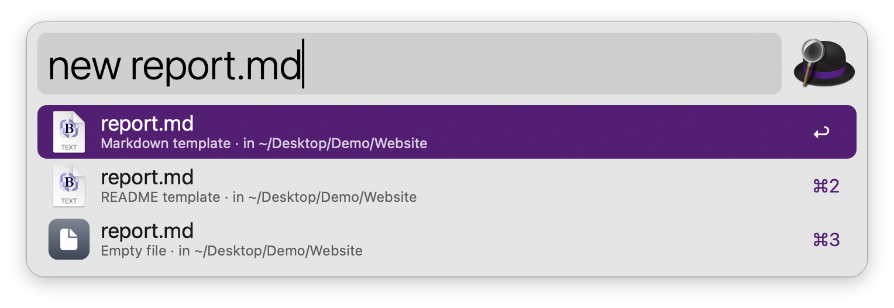
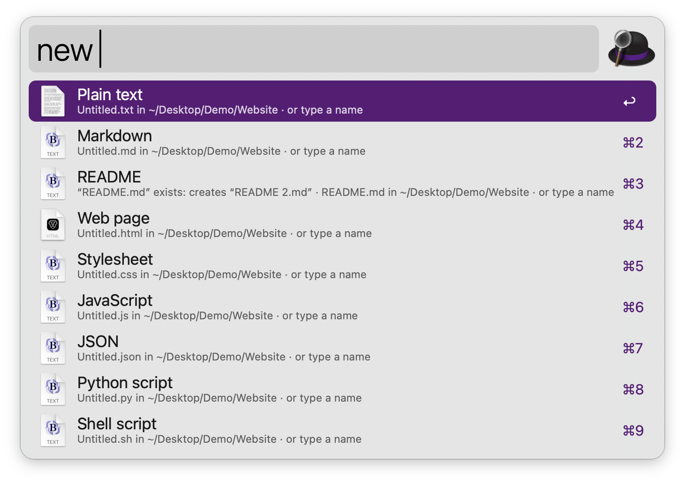
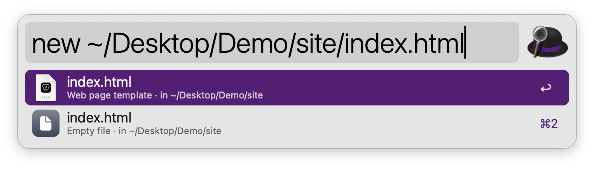
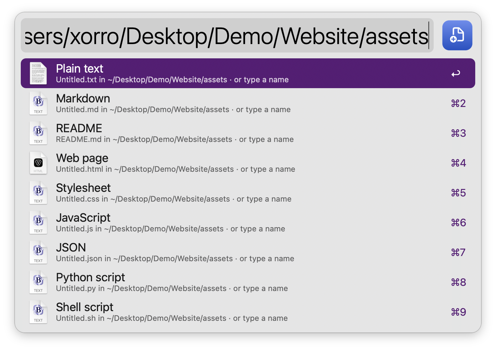
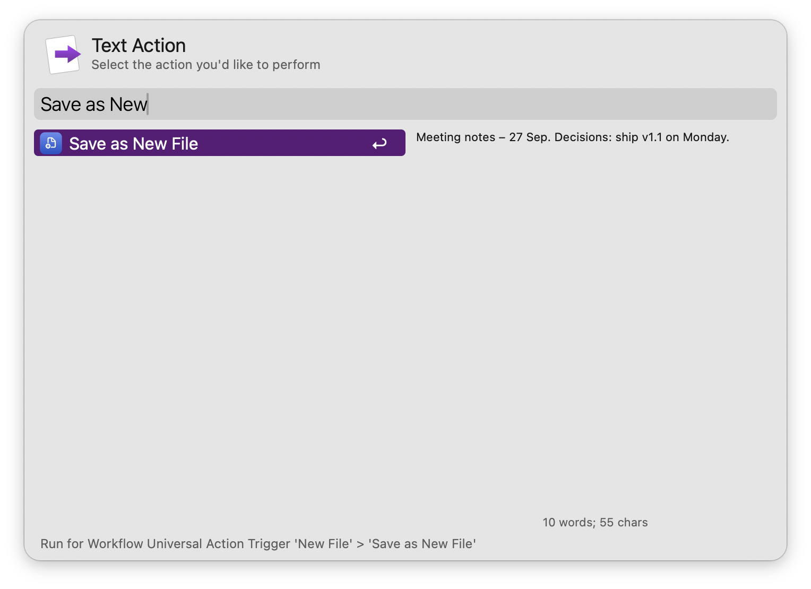
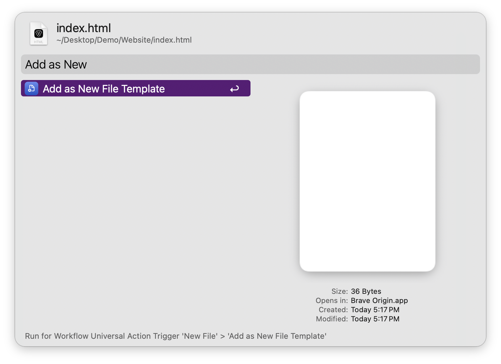

#  New File

Create files from templates in the frontmost Finder folder: Markdown, HTML, scripts, Word documents and your own templates. No dependencies: everything runs on tools that ship with macOS.

## Usage

Create a file in the folder of the front Finder window via the `new` keyword. Type a name with an extension, like `new report.md`, to create it from the matching template. Type a name without one, like `new notes`, to pick from every template type. With no Finder window open, files go to the default folder (the Desktop unless you change it).



* <kbd>↩</kbd> Create and open in the default app (or select it in Finder, or open it in the editor, as set in the Workflow’s Configuration).
* <kbd>⌘</kbd><kbd>↩</kbd> Create and select in Finder, ready to rename (open it instead when <kbd>↩</kbd> selects it).
* <kbd>⌥</kbd><kbd>↩</kbd> Create and open in the editor set in the Workflow’s Configuration.
* <kbd>⌃</kbd><kbd>↩</kbd> Create with the clipboard text as its contents.
* <kbd>fn</kbd><kbd>↩</kbd> Create and copy its path.
* <kbd>⌘</kbd><kbd>Y</kbd> Quick Look the template.

Leave the query empty to see every template. Type `new folder Photos` to create a folder. Existing files are never replaced: a clashing name gets a number, like `report 2.md`. Names starting with a dot, like `.env`, create hidden files.



Start with a path to create somewhere else, like `new ~/Projects/site/index.html`.



Alternatively, create a file in a selected folder via the Universal Action “New File Here”.



Save selected text as `Untitled.txt` in the same folder, selected in Finder and ready to rename, via the Universal Action “Save as New File”.



### Templates

Open the templates folder from the list shown by the empty `new` keyword. Any file you put there becomes a template, and its name (without the extension) is its label. The starters are plain text, Markdown, README, HTML, CSS, JavaScript, JSON, Python and shell scripts (created executable), CSV, rich text, Word and .gitignore.

Add a selected file as a template via the Universal Action “Add as New File Template”. Save a blank Pages, Numbers, Keynote or Excel document and add it this way to create those too.



In text templates, `{{name}}` becomes the new file’s name without its extension, `{{filename}}` its full name, `{{folder}}` the folder’s name, and `{{date}}`, `{{time}}`, `{{year}}` and `{{user}}` what they say. Values are escaped in HTML, XML, SVG and JSON files, so any name keeps the file valid. New files take the name `Untitled`, except templates named in capitals, like `README.md`, and dotfiles, like `.gitignore`, which keep their name.

Configure a Hotkey to show the templates, and set where files go, what <kbd>↩</kbd> does, the default folder, the templates folder and the editor in the Workflow’s Configuration.

## Development

```bash
swift tools/make_icons.swift tools/icons.json src   # regenerate icons
python3 tools/build.py --package                     # write src/info.plist and dist/*.alfredworkflow
python3 tests/test_newfile.py                        # run the tests
```

## AI disclosure

This workflow was developed with the help of Claude (Anthropic), an AI assistant. The code is reviewed and tested by the author.
